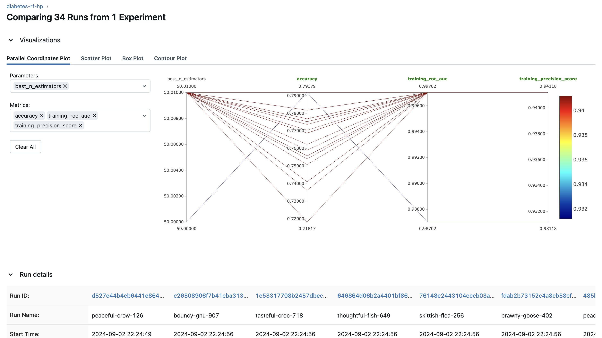
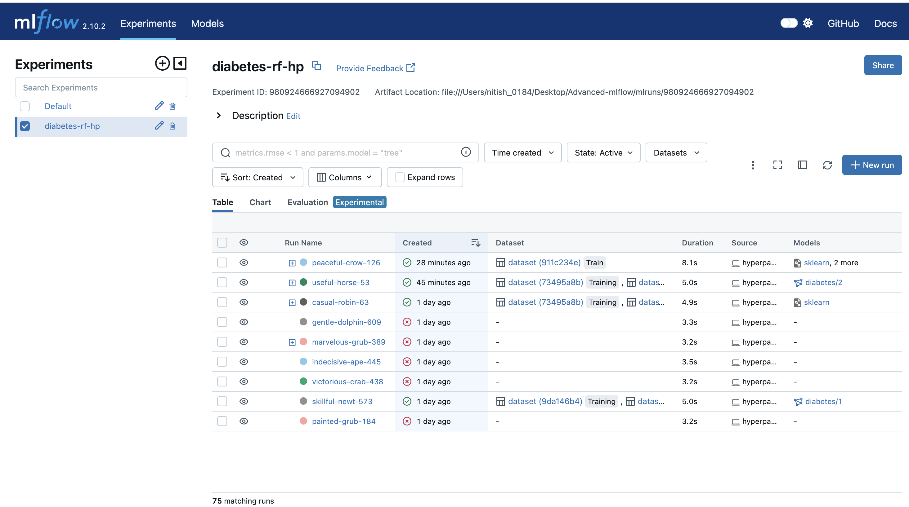

<<<<<<< HEAD
# Mlflow-Advanced
=======
# Advanced MLflow Concepts Implementation
This repository showcases advanced features of **MLflow**, including **autologging**, **hyperparameter tuning** using nested runs, and **model registry**. The project focuses on experiments conducted on the diabetes dataset using a **Random Forest Classifier** and **Grid Search CV**. The goal is to demonstrate how to leverage MLflow's powerful functionalities to streamline machine learning workflows and enhance model management.## Overview

## Features
### 1. Autologging
Utilized MLflow's **autologging** feature to automatically track and log metrics, parameters, and models during training. This simplifies the process of experiment tracking and reduces manual logging overhead.
### 2. Hyperparameter Tuning with Nested Runs
Implemented hyperparameter tuning using nested runs in MLflow to efficiently manage and track multiple training iterations with varying **hyperparameters**. This approach provides better visibility into the performance of different hyperparameter configurations and facilitates easier comparison of results.
### 3. Model Registry
Incorporated MLflow’s model registry to manage and organize different versions of models. This feature supports versioning, model stage transitions, and serves as a central repository for model management, making it easier to deploy and roll back models as needed.
>>>>>>> c8e940c (initial commit)
